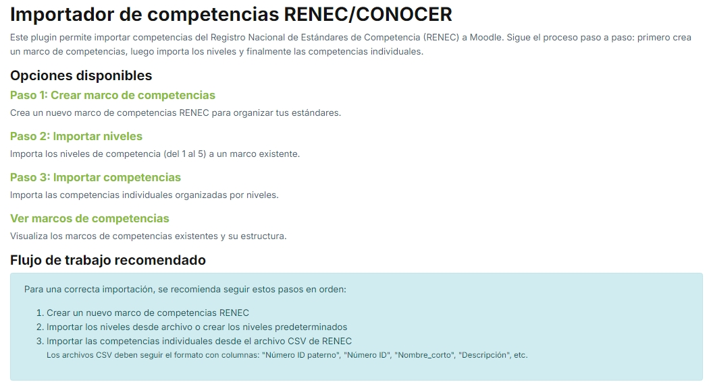
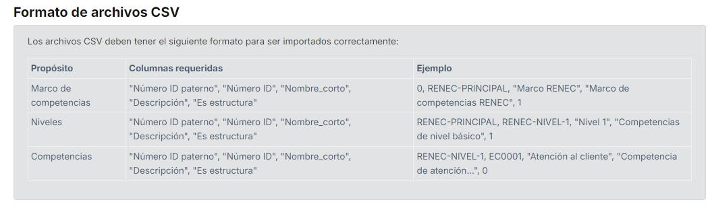
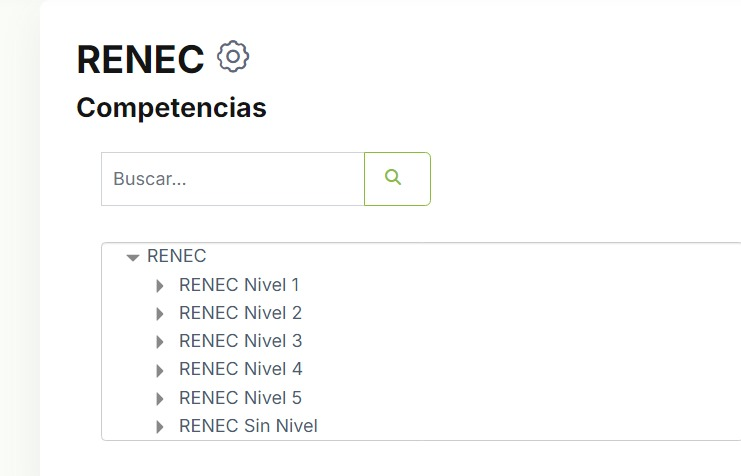
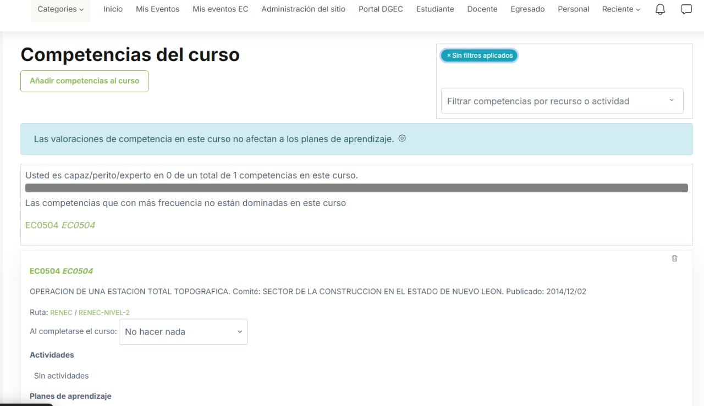

# renec - Creador/Importador de competencias RENEC/CONOCER para Moodle

Este plugin permite importar competencias del Registro Nacional de Estándares de Competencia (RENEC) a Moodle, transformándolas en un marco de competencias estructurado y utilizable dentro de la plataforma.




## Características

- Creación de marcos de competencias para organizar estándares RENEC/CONOCER
- Importación de niveles de competencia (del 1 al 5) o creación automática de niveles predeterminados
- Importación de competencias individuales organizadas por niveles
- Soporte para formato CSV con estructura específica de RENEC
- Opciones de sobrescritura y actualización de competencias existentes
- Múltiples codificaciones y delimitadores para archivos CSV
- Interfaz intuitiva con flujo de trabajo guiado
- Reportes detallados de importación

## Requisitos

- Moodle 4.1 o superior
- Plugin de competencias activado (tool_lp)
- Permisos de administración para crear marcos de competencias

## Instalación

1. Descargue el código fuente del plugin
2. Descomprima el archivo en la carpeta `/local/renec` de su instalación de Moodle
3. Acceda como administrador a su sitio Moodle
4. Vaya a "Administración del sitio" > "Notificaciones"
5. Siga las instrucciones para completar la instalación
6. Teclee en su navegador con el rol de usuario "admin" https://SITIOMOODLE/local/renec/, siga los pasos. 
7. Una vez instalado y ejecutado el paso 6, podrá acceder al plugin desde "Administración del sitio" > "Competencias" > "Competencias RENEC/CONOCER"

## Uso

El plugin utiliza un flujo de trabajo en tres pasos:

### Paso 1: Crear marco de competencias

Cree un nuevo marco de competencias RENEC para organizar sus estándares. Debe especificar:
- Un nombre para el marco
- Un ID único (se recomienda "RENEC-PRINCIPAL")
- Una descripción (opcional)
- Una escala de evaluación (se recomienda una escala de 5 niveles)

### Paso 2: Importar niveles

Después de crear el marco, puede:
- Crear automáticamente los niveles predeterminados (del 1 al 5 y "Sin nivel")
- Importar niveles desde un archivo CSV con formato específico

Los niveles organizan las competencias en categorías como básico, intermedio, avanzado, etc.

### Paso 3: Importar competencias

Finalmente, importe las competencias individuales:
- Seleccione el marco creado anteriormente
- Cargue un archivo CSV con las competencias
- Configure opciones avanzadas como codificación, delimitador, sobrescritura, etc.
- Importe las competencias, que se organizarán automáticamente bajo los niveles correspondientes

#### Pasos subsecuentes

Después de crear el marco, puede:
- Validar las competencias en su sistema
- 
- Asigar las competencias a los eventos de educación continua
- 

  
## Formato de archivos CSV

El plugin está diseñado para trabajar con archivos CSV que tengan la siguiente estructura:

### Archivo de marco de competencias
```csv
"Número ID paterno","Número ID","Nombre_corto","Descripción","Es estructura"
0,RENEC-PRINCIPAL,"Marco RENEC","Marco de competencias RENEC",1
```

### Archivo de niveles
```csv
"Número ID paterno","Número ID","Nombre_corto","Descripción","Es estructura"
RENEC-PRINCIPAL,RENEC-NIVEL-1,"Nivel 1","Competencias de nivel básico",1
RENEC-PRINCIPAL,RENEC-NIVEL-2,"Nivel 2","Competencias de nivel intermedio",1
```

### Archivo de competencias
```csv
"Número ID paterno","Número ID","Nombre_corto","Descripción","Es estructura"
RENEC-NIVEL-1,EC0001,"Atención al cliente","Competencia de atención...",0
RENEC-NIVEL-2,EC0002,"Ventas especializadas","Competencia de ventas...",0
```

Notas importantes sobre los archivos CSV:
- El campo "Es estructura" debe ser 1 para marcos y niveles, 0 para competencias
- El "Número ID paterno" indica la relación jerárquica entre elementos
- Se pueden importar varios archivos de competencias por nivel o todos juntos

## Solución de problemas

- **Los niveles no se crean**: Verifique que el archivo CSV tenga el formato correcto y que el valor de "Es estructura" sea 1 para los niveles.
- **Las competencias no se importan**: Asegúrese de que los niveles referidos en "Número ID paterno" existan o active la opción "Crear niveles faltantes".
- **Caracteres extraños**: Pruebe diferentes codificaciones en la sección de opciones avanzadas.
- **Columnas no detectadas**: Confirme que los nombres de las columnas sean exactamente como se especifican en la documentación.

## Licencia

El plugin es de código abierto y está licenciado bajo la GNU General Public License versión 3 o posterior.

## Autor

Este plugin fue desarrollado por Sebastián González Zepeda en EducacionContinua.ucol.mx © 2025.

## Contribuciones

Las propuestas de mejora o correcciones a través de pull requests o issues en el repositorio del proyecto no están habilitadas por restricciones de tiempo del autor.

## Historial de versiones

- 1.0.0 (Feb 2025): Versión después de los últimos ajustes del plugin
